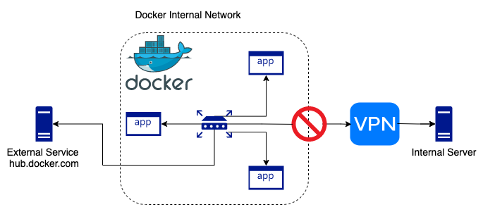

# Docker can’t build over VPN
Docker Desktop does a great job of taking care of all the networking for you and usually _“just works”_, even if you are connected to a corporate VPN.

Sometimes you may encounter difficulties which usually manifest as the **build stage failing**. This can happen when part of your build process requires resources that are only available when connected via your company VPN (e.g. internal package server).


<!--truncate-->

## The Problem
### Tl;dr
Docker may have allocated an internal network range which clashes with your VPN.
### Detailed example
Your project has dependancies on an internal server which might have an IP address of `172.17.2.79`. This is a [private network](https://en.wikipedia.org/wiki/Private_network)) which is only accessible while connected to the companies private VPN.
Docker has created its own internal network which is using the  `172.17.0.0/16` range of addresses.
The build process tries to access your companies private package server at `172.17.2.79`.  The process is running within the private docker network. It therefore thinks the server should be available on the local docker network. It is also unable to send any traffic via the VPN due to the overlap or clash of the network range.
## Confirming this is the problem
To confirm the above scenario is indeed the root cause of the docker build failure, we need to compare the subnet docker is using against that in use by the VPN.
**### Get Docker Network**
First, list all the available docker networks
```
$docker network ls
```
which should output something similar to
```
NETWORK ID     NAME      DRIVER    SCOPE
ceb424d5d73d   bridge    bridge    local
ad6318517651   host      host      local
a2cfb19e8122   none      null      local
```
We’re interested in the “bridge” network, so we’ll inspect it by using it’s ID:
```
$docker network inspect ceb424d5d73d
```
which should contain something like the following in its output
```
"Config": [
    {
        "Subnet": "172.17.0.0/16"
    }
]
```
So we know that in the above case, docker is using the network range `172.17.0.0/16`
**### Get VPN Network**
Next we need to find out what network the VPN is using. The below should work on a MacBook Pro or linux. If you’re running on Windows, `ipconfig` may work better.
From a terminal enter the command `$ifconfig` or `$netstat -i` and look for a `utun*` entry with an IP address. For example, doing `$netstat -i` might output:
```
utun3      1500  <Link#17>                      2298484     0   754726     0     0
utun3      1500  172.17.144/22 172.17.146.96    2298484     -   754726     -     -
```
This tells us the the VPN is using the network range `172.17.144/22`.
If you can remember your [CIDR blocks](https://en.wikipedia.org/wiki/Classless_Inter-Domain_Routing#IPv4_CIDR_blocks), you’ll see that the docker network collides with that of the VPN. This means that docker will be unable to use the VPN network to get to our internal server which has the address `172.17.2.79`.
## Docker Network Fix
To resolve the above problem, we can change the address pool used by the docker daemon.
With docker desktop, the easiest way to achieve this is to open the docker desktop dashboard (UI), click the “settings” gear cog in the top right of the screen to view the preferences screen. Select “Docker Engine” from the left hand menu, which should show some JSON config. Add the below section of config into the existing JSON config (keeping what’s already there), and click the “Apply & Restart” button
```
"default-address-pools": [
    {
      "base": "172.240.0.0/16",
      "size": 24
    }
  ],
```
Now if you repeat the steps to [Get Docker Network](#Get-Docker-Network) (note, the network ID most likely changed!), you should see that docker now uses subnet `172.240.0.0/24`, and `docker build` should now be able to complete steps such as `dotnet build` which would have previously failed to reach the internal server