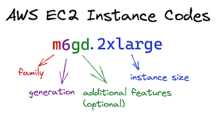

To try and make it easier to select an instance type, AWS uses a set format for instance type naming. 
This article will help you understand how AWS breaks down the instance type into families, generations, 
capabilities and overall size.

<!--truncate-->

EC2 is Amazon Web Services’ (AWS) **Elastic Compute Cloud**. 
As AWS has to support an almost endless set of possible workloads, they provide hundreds of different instance types.  
Having different instance types means you only use and pay for resources that you need, 
rather than over provisioning and paying for unused resource.

> EC2 is an abbreviation for “elastic compute cloud”.
> Where the same letter appears more than once, a count of that letter is used (e.g. two consecutive C's become C2)
> Another example being S3 : Simple Storage Service - 3 S's

Pretty much the only constant thing when working with AWS is that things change. 
This article therefore is only meant to help you understand the EC2 instance code format rather than explaining every
possible instance type available. 
You can see what instance types are available here: [Amazon EC2 Instance Types - Amazon Web Services](https://aws.amazon.com/ec2/instance-types/) 

## Instance code format
As you can see from the above image, the instance code is divided into three or four sections (one section is optional).  

### Family
The first section is typically a single letter (but not always) and denotes the main instance type family. 
The family lets you choose a type broadly suited to your tasks, and the most popular ones are discussed below (e.g. CPU optimised, memory optimised etc.)

### Generation
The higher the generation number the newer the instance type. You should usually choose the latest available 
generation as that provides the newest features and generally can cost less. i.e. a newer generation might offer faster
 CPU's, or more CPU, or more memory, or some other combination of features with better cost optimisation. 
The exception to this rule might be if you only want to use the AWS free tier, as (at the time of writing) 
the `t2.micro` is free tier eligible, but the `t3.micro` is not.

### Additional Features
This is an **optional** code. For example, `R6gd` instances offer 
*local NVMe-based SSDs are physically connected to the host server and provide block-level storage that is coupled to the lifetime of the instance*, 
where `R6g` is *EBS-Only storage*.

### Instance Size
The part after the period (dot) defines the instance size. This is usually a T-Shirt style size, but there are other options
 too like *.metal* for example.

## Popular Family Types
### A - Arm Processors
| | Description|
|---|---|
|Characteristics|64-bit Arm cores using Graviton processors.|
|mnemonic|**a** for Arm processor|
|example|a1.large : 2 CPU and 4 GiB Mem|

### T - General Purpose, Burstable
| | Description|
|---|---|
|Characteristics|T instances are general purpose that are “burstable”. If you use an “m” or “c” class type, you’re paying for the full capacity of the instance whether it’s in use or not. As a lot of workloads can have spikes of demand and longer periods of low demand, you can potentially save money by using a T type. T type machines have a baseline of capacity. When your system operates below the baseline, you earn CPU credits. When your system comes under high load, it can “burst” to use all the CPU by spending credits (or borrowing up to a days worth of credits depending on how you configure your instance).|
|mnemonic|**t** for bursTable|
|example|t3.large : 2 CPU 8 GiB mem (36 CPU credits/hr)|

### M - General Purpose, Medium
| | Description|
|---|---|
|Characteristics|General purpose machines optimised balance of CPU, memory and network performance|
|mnemonic|**m** for medium|
|example|m5.large : 2 CPU 8 GiB mem|

### C - General Purpose, Compute
| | Description|
|---|---|
|Characteristics|Optimised for compute intensive workloads.|
|mnemonic|**c** for Compute|
|example|c5.large : 2 CPU 4 GiB mem|

### R - General Purpose, Memory
| | Description|
|---|---|
|Characteristics|optimised for memory.|
|mnemonic|**r** for RAM|
|example|r5.large : 2 CPU 16GiB mem

### Others
#### Accelerated computing
Optimised for machine learning, graphics, image processing etc. Some examples include the P[ictures], inf[erence] and g[raphics] types.

#### Storage
Instances optimised for storage, i.e. where high sequential read and writes operations on large data sets is desirable
Examples include D[ense] (or D[ata]), I[ops], H[dd] based and others