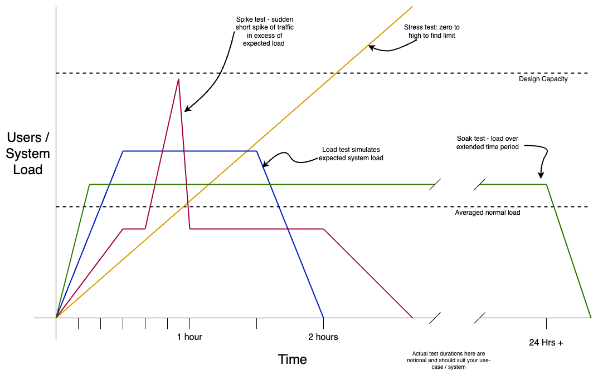
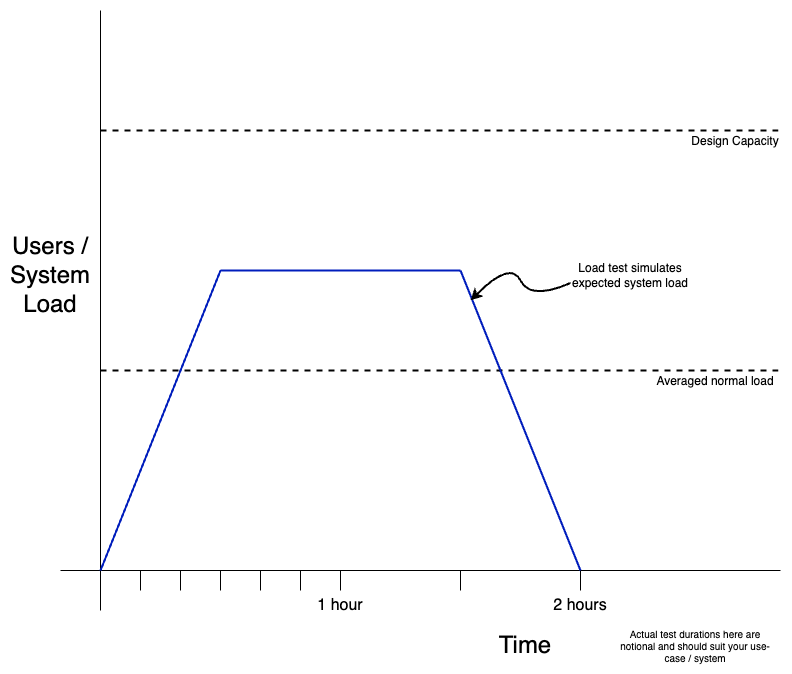
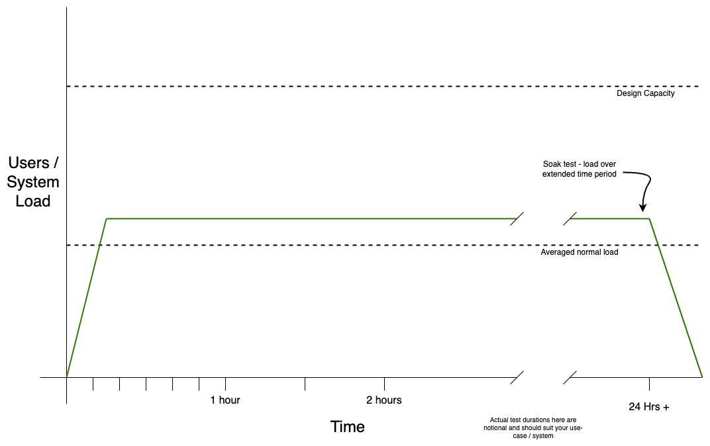
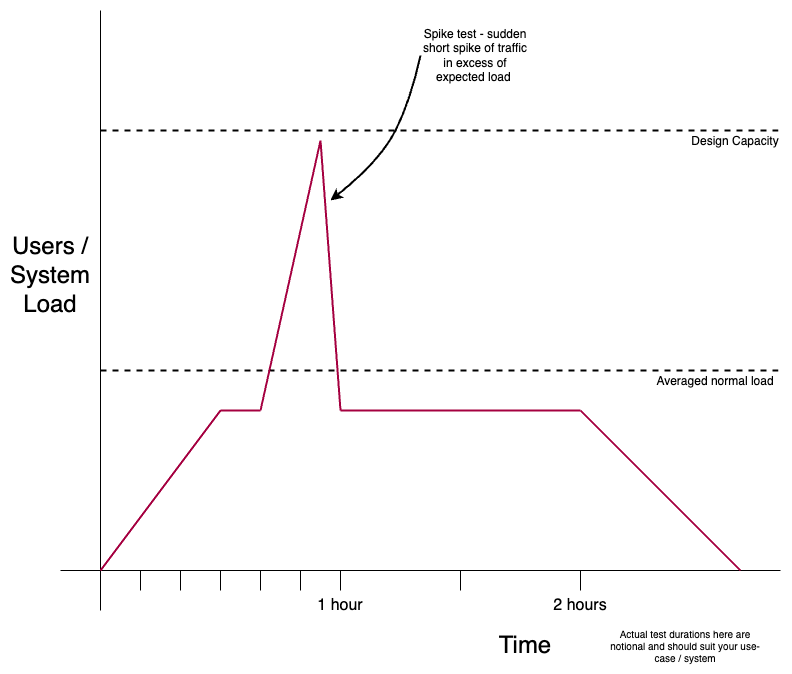
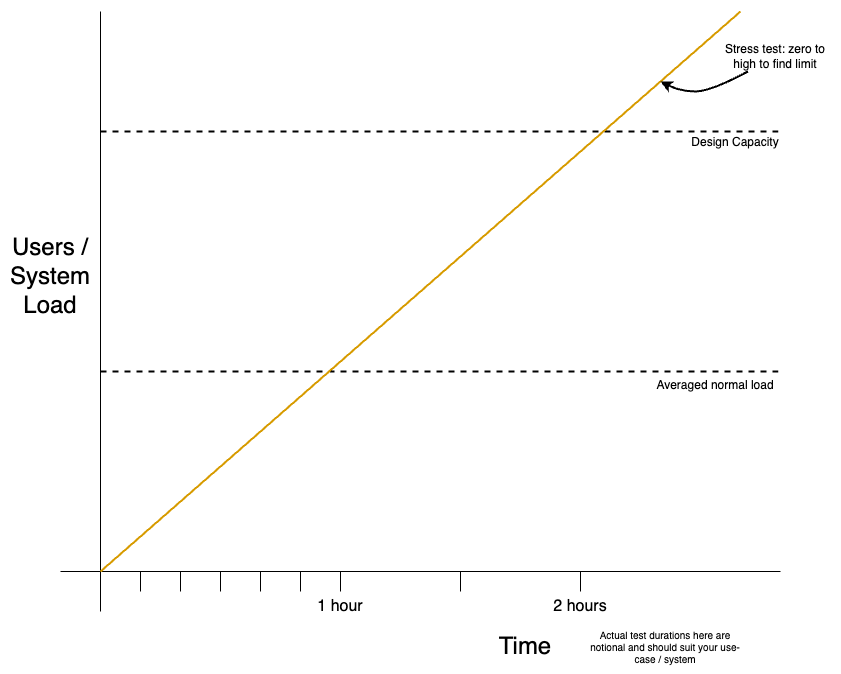

# Performance Testing Basics
Performance testing is more than just sending a large number of requests at a target system to see what happens. 

Performance testing can help you to understand how many requests your system can handle, how long it takes to respond, 
if a recent code change has improved or reduced performance and more. It can help you plan for when you need to scale 
your application, define server resources like CPU, memory and disk space, and consider the introduction or improvement 
of caching.

<!--truncate-->

You may not need to have a full performance test suite straight away, so consider;
- What are you trying to test and why
- Do you know what good looks like
- What environments are available, and how much are they like production environments
- For an API, which endpoints/calls will you test, and can you (or do you need to) vary each request to avoid testing the cache layer

## SLI’s and SLO’s
Service level indicators (SLI) and service level objectives (SLO) are a set of things you can define to describe what 
good looks like, and then use as a benchmark for your performance tests. It will also help you understand the different 
types of performance tests you should consider.

**SLI’s** are things that are important to measure and report on, e.g. how long it takes to return a response to a 
request, or the error rate (maybe as a percentage of all requests)

**SLO’s** are objectives or target values for your service, of something that is measured by an SLI. e.g. a 
response should be returned within 100 milliseconds.

It’s a good exercise to agree a set of SLI and or SLO with the team before you start performance testing.

## What can performance tests help us understand
-   Slow response times
-   Long load times
-   Bottlenecks
-   Scalability problems (disk, CPU, memory, memory leaks, network)
-   Software problems
-   Software / Framework / Cache configuration problems
-   Insufficient resources

## Where and When to test
Running against your production system is probably a bad idea. As well as effecting your own production system, you 
could potentially cause third party systems problems too!, not that I've ever inadvertently tested this theory ;) 

If you use cloud hosting, you can probably create a production like system fairly easily. 

If you cannot provision a production like environment to test against, you should resist “interpreting” the results to 
scale them up or down accordingly to get an approximation of how your production service will behave; You cannot be 
sure the hardware will scale linearly (e.g. you can’t rely on doubling CPU resulting in double the performance). You can
 however keep a record of previous tests and gain insight into if recent changes have improved or regressed performance 
on the test system. This could give you confidence to proceed to release to production.

You could run your performance tests against a single server or node in your production estate if you are confident you 
won’t harm your service or business that it serves. This could be by targeting a single node or server that is out of 
traffic.

You should capture and store the results of your performance tests so that you can track the performance results over time.

## Types of Performance Tests

## Smoke Tests
Smoke tests are used to verify your service is functioning while only putting minimal load through the service.

## Load Tests
Load testing will test your service by simulating actual users of your system. This allows you to observe how things 
like your database, code and hardware behave under load.

This type of test should use expected load levels. It could be based on your SLO’s or non-functional requirements (NFR)’s. 
You probably want to slowly ramp up requests from zero over a short time (half an hour)x§x  to “warm” the service under 
test and its server. The expected load should then be sustained for at least a further one to two hours before another 
gradual ramp down to zero requests.

## Soak Tests
These are the same as load tests, except that they will run for a much longer period (twelve to twenty-four hours or 
more). Soak tests will help you identify things like memory leaks which could be hard to detect over shorter term load tests.

## Spike Tests
Spike tests again extend the basic load test. This time a short “spike” of traffic in excess of the expected load is 
used to verify that your service can cope or recover from sudden large increases in load

## Stress Tests
A stress test will start with zero load, and gradually increase until well over the maximum expected capacity of the 
service. This type of testing allows you to plan for the future so your service is ready. This could help define things 
like:
- defining auto-scaling
- increasing server capacity (horizontal or vertical scaling)
- introducing or improving caching
- code changes (to optimise performance, remove bottle-necks etc)
- and much more

