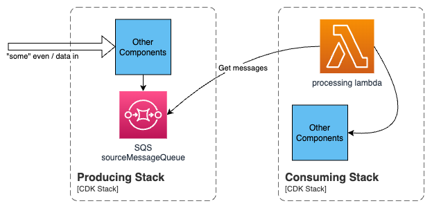
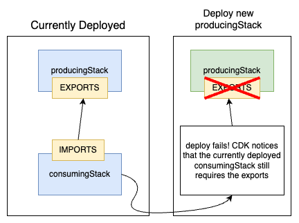

# AWS CDK export cannot be deleted as it is in use
Sometimes you try deploying a change to an existing multi-stack CDK project, only to get an error message similar to "**Export cannot be deleted as it is in use**". Read on if you've encountered this error and are struggling to fix it, or you're just interested in finding out about dependent stacks in AWS.
## AWS CDK dependent stacks
AWS CDK makes it easy to share resources in different stacks. For example, allowing an SQS queue from one stack to be used by a lambda in a different stack. In this case, CDK automatically takes care of cross stack references, and also ensures deployments happen in the correct order.



The problem you've probably encountered seeing as you're here, is that you're trying to remove  that cross stack reference, but you see  something like:
`Export <<some AWS ref>> cannot be deleted as it is in use by <<some stack>>`

## How did this happen
Cross stack references occur when you have two stacks, and you share something from one stack with the other. When CDK is building the cloudFormation template, it will automatically manage these cross stack references. It does this by "exporting" the construct from the producing stack (using an auto generated name), and "importing" the construct in the consuming construct.

If you make a change that impacts the cross stack dependency, you can find yourself in a circular trap where CDK knows it has to deploy the producingStack first, but that fails because the existing (already deployed) version of the consuming stack still requires the exports you're trying to remove, and it cannot deploy the consumingStack first because that depends on the producingStack.



## Example
Given a stack `producingStack` that creates an SQS queue, and a `consumingStack` that has a lambda function that is allowed to push messages to the SQS queue, we end up with (partial) CDK code that looks a little like below (full example code can be found [here](https://github.com/martynbutty/cdkDependantStacks))

```typeScript
...
export class producingStack extends cdk.Stack {  
    public readonly sourceQueueArn: string;  
    public readonly sourceQueueUrl: string;  

    constructor(scope: Construct, id: string, props?: cdk.StackProps) {  
        super(scope, id, props);  

        const sourceMessageQueue = new sqs.Queue(this, 'sourceMessageQueue', {  
            queueName: 'sourceMessageQueue'  
        });  

        this.sourceQueueArn = sourceMessageQueue.queueArn;  
        this.sourceQueueUrl = sourceMessageQueue.queueUrl;  
        ...
```


```typescript
export class consumingStack extends cdk.Stack {  
    constructor(scope: Construct, id: string, props: HotelsDataAcquisitionStackProps) {  
        super(scope, id, props);  

        const queue = aws_sqs.Queue.fromQueueArn(this, 'sourceQ', props.sqsArn);  

        const eventSource = new SqsEventSource(queue, {  
            batchSize: 10,  
            reportBatchItemFailures : true,  
            enabled: true  
        });  

        const lambdaEnvVars = {  
            SQS_QUEUE_URL: props.sqsUrl  
        };  

        const processingLambda = new NodejsFunction(this, 'processingLambda', {  
            entry: './lambda/index.ts',  
            runtime: aws_lambda.Runtime.NODEJS_18_X,  
            handler: 'main',  
            environment: lambdaEnvVars  
        });  

        processingLambda.addEventSource(eventSource);  
    }  
}
```

We have already deployed these stacks, and are now trying to refactor our solution to remove the cross stack dependency.

### Refactor to remove a dependency 
For this example, we're going to simply remove the SQS URL in the lambda's environment variable. producingStack is unchanged, and consumingStack looks like below. 

> You'd normally just delete code that's no longer required, but it's shown commented out here to make it easier to see what's changing.

```typescript
export class consumingStack extends cdk.Stack {  
    constructor(scope: Construct, id: string, props: HotelsDataAcquisitionStackProps) {  
        super(scope, id, props);  

        const queue = aws_sqs.Queue.fromQueueArn(this, 'sourceQ', props.sqsArn);  

        const eventSource = new SqsEventSource(queue, {  
            batchSize: 10,  
            reportBatchItemFailures : true,  
            enabled: true  
        });  

        // const lambdaEnvVars = {  
        // 	SQS_QUEUE_URL: props.sqsUrl
        // };  
        
        const processingLambda = new NodejsFunction(this, 'processingLambda', {  
            entry: './lambda/index.ts',  
            runtime: aws_lambda.Runtime.NODEJS_18_X,  
            handler: 'main'
            // environment: lambdaEnvVars  
        });  

        processingLambda.addEventSource(eventSource);  
    }  
}
```

When you try to `cdk deploy` this change, you get a failure
`Stack Deployments Failed: Error: The stack named producingStack failed to deploy: UPDATE_ROLLBACK_COMPLETE

The cause of the rollback is output on the CLI output but it gets hidden at the end. To find it another way, you can use the AWS console -> cloudformation -> producingStack -> events, where we see the offending error:
`Export producingStack:ExportsOutputRefsourceMessageQueueE741C4AF715E0816 cannot be deleted as it is in use by consumingStack`

If we do a `cdk diff` we can see that an export is being removed
```
...
Outputs
[-] Output ExportsOutputRefsourceMessageQueueE741C4AF715E0816: {"Value":{"Ref":"sourceMessageQueueE741C4AF"},"Export":{"Name":"producingStack:ExportsOutputRefsourceMessageQueueE741C4AF715E0816"}}
...
```

CDK automatically created this export when it first detected the cross stack dependency, and it is now attempting to remove it because of our change to consumingStack.

#### What went wrong
CDK knows that consumingStack depends on producingStack (for the SQS exports).  Any deploy will therefore trigger the deploy of the producingStack first, __even if you try to just deploy the consumingStack__.

In our case, we've only changed the consumingStack. This change means CDK notices we no longer need to "export" the SQS URL, so it removes that export, as can be seen in the above `cdk diff` partial output. 

CDK tries to first apply the change to producingStack. This change is to remove the export of the SQS URL.  However, CDK notices that the currently deployed version of consumingStack still has an import on that URL (it hasn't deployed the change to the consumingStack yet). So CDK fails the deploy and rolls-back.

### The fix
To fix this problem, we make a temporary code change in `producingStack` to explicitly export a ref to the SQS URL. This is in addition to the decoupling change we already made in `consumingStack`. This export will therefore be in the cloudformation template regardless of if it is actually used or not. To achieve this, we use the AWS CDK [`exportValue()`](https://docs.aws.amazon.com/cdk/api/v2/docs/aws-cdk-lib.Stack.html#exportwbrvalueexportedvalue-options)  function. In our case, we add the below to `producingStack`:

`this.exportValue(sourceMessageQueue.queueUrl);`

> Note: If you're observant, and wanted to completely decouple the stacks, we'd also have add another export as we also implicitly use the SQS ARN in the initial version. So you'd also add:

`this.exportValue(sourceMessageQueue.queueArn);`

To confirm our change worked we can run another `cdk diff`. This time you should notice that the export is no longer removed (we know this by the absence of it's removal / negating output from the diff). CDK can therefore safely deploy `producingStack` without compromising the deployed (old) version of `consumingStack`. It then deploys the new version of `consumingStack` which removes the dependency.

Now we managed to deploy and remove the dependency, we can make a second change to remove the temporary exports (the `exportValue()`) and redeploy again to be in a clean state. This time a `cdk diff` should show the removal of the exports, but this is on now that `consumingStack` no longer depends on the export.

## Useful commands
- Use `cdk diff` to check for removed "exports". If you see any, then retain them by manually exporting them with `exportValue()`.
- To see if the currently deployed versions of your stacks have any exports: `aws cloudformation list-exports`. Note: you will probably always have some exports as the underlying CDK deployment framework usually creates a couple of exports.
- You can see the exports locally in your `cdk.out` directory. For our example, look in `./dependantStacks/cdk.out/producingStack.template.json` for the `Outputs` section
- You can see the exports in the **currently deployed** versions by viewing the cloudformation template in the AWS console -> cloudformation -> producingStack -> template
- Given an export name, you can see which stack(s) use it: `aws cloudformation list-imports --export-name producingStack:ExportsOutputRefsourceMessageQueueE741C4AF715E0816`
