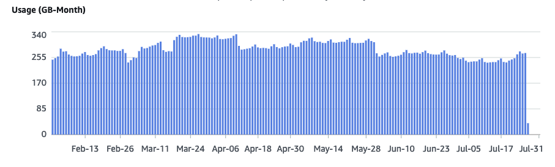

In a previous article [Aurora Serverless database selection](/blog/2023/08/01/Aurora-Serverless-database-selection), I discussed the high level considerations around selecting or upgrading to an Aurora server-less V2 database.

If you decided that Aurora V2 is the way to go for your needs, one important but sometimes overlooked aspect is disaster recovery (DR), and in particular the backup configuration of your database. The following discusses some of the main points for configuring backups of an Aurora server-less V2 database.

<!--truncate-->
[Image by rawpixel.com](https://www.freepik.com/free-photo/error-something-went-wrong-construction-concept_18122893.htm#query=data%20loss&position=20&from_view=search&track=country_rows_v2) on Freepik

## Aurora backups

AWS offers automated continuous backups from one to thirty five days. This period is known as the **retention period**.

Automated backups store the information required to be able to restore the cluster to any point in time during the retention window. They are incremental and charged based on the amount of storage required for this restoration ability.

Database cluster snapshots are always a full backup of the cluster at the time it was taken.

You can retain data outside of the retention period by taking a manual snapshot. Manual snapshots do not expire, but they do incur extra costs as they are not included in the free storage allowance (see below).

## Costs of backups

There is an amount of free storage (a.k.a. free tier) for backups:

*   There's no charge for a one day retention period
*   There's free storage (of backups) up to the value of the cluster volume size (`VolumeBytesUsed` in cloudwatch metrics).
*   There's free unlimited storage for all snapshots that lie within the retention period (including manual snapshots).

The backup storage includes all the incremental records stored to allow a restore to any point within the retention period. The minimum storage required will therefore always be the cluster size just before the retention period.

The total billed usage for automated backups will never exceed the cumulative cluster volume size over the retention period. For example, with a five day retention period of a 10GB cluster that didn't increase in size over the five days, you would never exceed 50GB (5 days X 10GB).

For databases with lots of changes, the size of the automated backup grows over time. If a database slows or stops growing (i.e. stops experiencing changes), the size of the automated backups will decrease as the stored changes leave the retention window.

Manual snapshots, and AWS backup snapshots are chargeable when they fall outside of the retention period.

### Cost examples

*   Database start cluster size: 100GB
*   Retention period: 10 days
*   Daily database growth: 5GB ^1

Calculated automated backup storage: `100GB [initial volume size] + (10 X 5GB) [size of incremental records] = 150GB total backsup usage`

Subtract the free tier Database cluster volume size at end: 125GB ^2

Billed storage: `150GB [total storage required] - 125GB [latest volume size] = 25GB billed usage`

^1 It's probably unrealistic to assume any database would grow by the same amount every day, but I have here just to make the calculations simpler to understand

^2 Simplified assumption that all inserts, updates and deletes result in this final volume size.

You are billed **per GB month**, as a weighted average over the month. Therefore if you used 100GB over 15 days and 0B for the other 15 days you'd be charged: `((100GB X 15 days) + (0B X 15 days)) / 30 = 50GB-month`

At the time of writing, backup costs $0.021 per GB-month, so the above example would cost just $1.05 for the backup storage.

## Useful metrics
|Metric|Description|
|---------|---------|
|`BackupRetentionPeriodStorageUsed`|storage in bytes of cluster plus changes for the retention period.|
|`SnapshotStorageUsed` |backup storage used in bytes for manual snapshots beyond the retention period of the automated backup period|
|`TotalBackupStorageBilled` |the `BackupRetentionPeriodStorageUsed` + `SnapshotStorageUsed` - `free tier`. (free tier will be the latest recorded size of the cluster)|

To get an idea of database growth, you can use AWS cost explorer:
*   Granularity: daily
*   Services: RDS
*   Usage type group: RDS: storage
*   Tag: product -> team/product name

## Backtrack

Worthy of mention is [Backtrack](https://docs.aws.amazon.com/AmazonRDS/latest/AuroraUserGuide/AuroraMySQL.Managing.Backtrack.html). Backtrack allows you to "rewind" the DB to a specified time. Backtrack should NOT be used instead of backups, but to complement backups.

Backtrack will only be available if it was enabled when your cluster was created, and has a limit of 72 hours as the max backtrack window. There is additional costs associated with backtrack.

For more info, please follow the link above.

## Summary

Your first step to configuring backups is to understand your database and application.

If a erroneous change was made to you data or schema that didn't get noticed for a few days, would you want to be able to restore to just before that point in time, or attempt to forward fix the data?

How large is your database and how much does it grow each month?

The combination of the above two points, should allow you to come up with some ballpark cost calculations, which should allow you to find a sweet spot of backup retention period vs cost optimisation.

Be cautious of selecting a backup retention period that optimises on cost of backups. If you had to spend a few days with multiple people trying to manually fix your data, that could easily (and significantly) outweigh any saving on the cost of backup storage.
