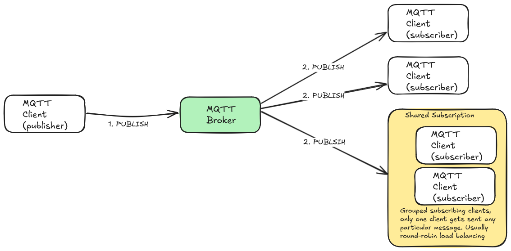
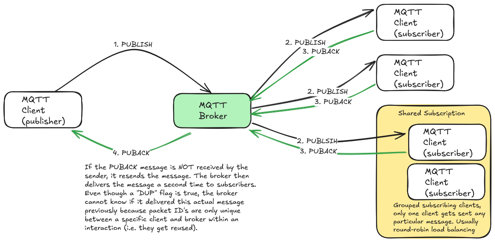
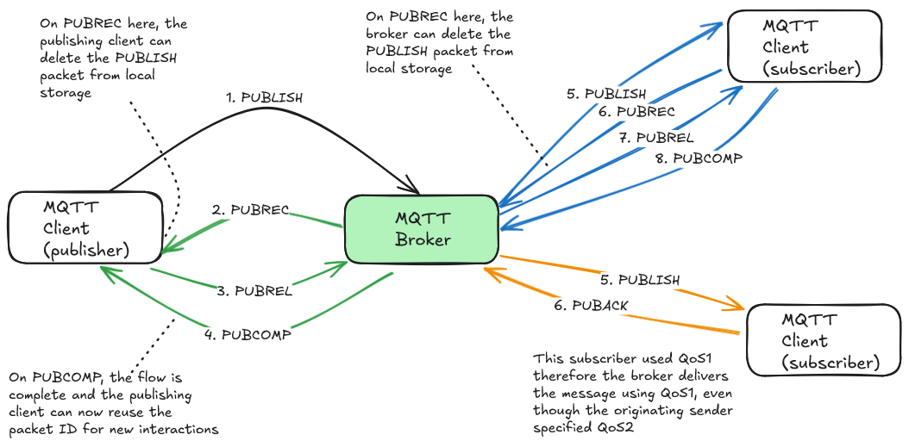

# MQTT main features
MQTT is a messaging protocol designed to be lightweight. This makes it ideal for Internet of Things (IoT) applications where the ability to conserve CPU, electrical energy consumption and bandwidth are key considerations.
title: MQTT main features
description: A quick guide to the main features and consdierations of the features of the MQTT protocol

# MQTT Protocol
MQTT is a messaging protocol designed to be lightweight. This makes it ideal for Internet of Things (IoT) applications where the ability to conserve CPU, electrical energy consumption and bandwidth are key considerations.

MQTT is a publish / subscribe messaging protocol. Messages are published by a client, and zero, one or more subscribers can receive a copy of that message.

**MQTT is not a message queue**. If a subscribing client is disconnected, it will not receive any of the messages that might have been published while it was offline. There are exceptions to this, for example the single most recent message of a topic can be sent if it was published with the **retain** flag set to true. Using QoS1 or QoS2 with persistent sessions can also send all messages received during the offline period, subject to memory limits and session expiry setting.

## Retained messages
Imagine you have a smart home app on your phone. In your smart home you have multiple devices such as smart controlled lights. For this example, you also use an MQTT broker to handle the  communications between the smart devices, home server and app. The app subscribes to various MQTT topics in order to display status information. 

When the app first starts up, there won't be any messages on the topics it subscribes to until something changes. For example if a light is switched on, a status message will be published to notify of that change. Therefore the elements in the apps UI will have an unknown state until each device is changed in someway.

Retained messages are a mechanism of addressing this problem. Retained messages keep the **last known message** on a topic (i.e. there is only one retained message per topic). In our smart home example, when the app first starts and subscribes to various topics on the broker, it will immediately be sent any retained messages on those topics. The app can therefore display the last known state. 

Not all messages sent to a topic need to be (or should be) retained. Therefore the retained message is only the most recent message sent to the topic with the retained flag set to true. For example if you sent a command to a car to open the windows, it doesn't make sense to be a retained message. This is because if the car is offline (e.g. in an underground carpark with no signal) you probably don't want the car to unlock the doors sometime later when it regains network connectivity. As a general guide, status messages are ideal for retained messages, but commands are not.

## Persistent sessions

As described above, a client starts and subscribes to topics on the MQTT broker. The broker will then deliver messages to the client as they are published. If the client disconnects from the broker for any reason, all the subscriptions are lost. The client then needs to re-subscribe to all its topics when it reconnects. The client will also never get any message sent while it is offline.

A client can setup a persistent session when it connects to the broker. This causes the broker to store relevant client state. The broker stores the clients subscriptions, so when the client reconnects it does not have to re-subscribe to all the topics again.  and messages to those topics while it is not connected. 

Additionally, any messages sent with QoS1 or QoS2 will be stored by the broker and delivered to the client when it reconnects. This satisfies the reliable message delivery defined by QoS1 and QoS2. In this mode, the MQTT broker behaves somewhat like a message queue, but depending upon your requirements, you may require a dedicated queue technology as there are limits. For example the stored messages will consume memory on the broker which could lead to dropped messages or worse, as there is no concept of a dead letter queue. As discussed above in retained messages, you should also consider how to handle messages that you would not want to action anymore, such as an expiration time on a command type message.
## Quality of Service (QoS)
Quality of Service in MQTT is the ability to define the delivery guarantee for a specific message. MQTT provides three levels of QoS:

| Level | Description   | Notes                                                                                                            |
| ----- | ------------- | ---------------------------------------------------------------------------------------------------------------- |
| 0     | At most once  | Your message isn't guaranteed to be delivered, and it will not be delivered more than once                       |
| 1     | At least once | Your message is guaranteed to be delivered. It's possible that it might be delivered more than once (duplicated) |
| 2     | Exactly once  | Your message is guaranteed to be delivered once, and only once                                                   |

The QoS level is an agreement for a single operation. For example with QoS 2 between a publisher and the MQTT broker, the message is guaranteed to be delivered to the broker. This initial contract does not however guarantee that all the subscribers will get the message exactly once.

### QoS 0 - At most once

With QoS 0 (zero), your message has no delivery guarantees. This is a fire and forget mode of operation. The sender does not get any acknowledgments of delivery, and the receiver does not have to handle duplicate messages (because that isn't possible). If something goes wrong such as the TCP connection being closed, then your message will not be sent.

### QoS 1 - At least once

QoS1 guarantees that your message will be delivered at least once. However with this level of QoS, it is possible that your message will be sent more than once. Your application therefore needs to be able to handle duplicate messages (or not care), i.e. the messages are idempotent.

This method works by the receiver of a message acknowledging delivery by sending a *PUBACK* message back to the sender. If the sender does not get a *PUBACK* message back, it will retransmit the message with a *DUP* flag set to true.

#### Duplicate messages with QoS1
A message is resent when a *PUBACK* message for the initial transmission isn't received by the sender (maybe the TCP connection fails). The resent message will contain a *DUP* flag set to true to indicate that it is a duplicate message.  

Even though the second copy was sent with the *DUP* flag set to true, this doesn't prevent the broker from sending duplicate messages to subscribers. This is because the *packet ID* of messages can be reused. A packet ID is only unique within an interaction.  Once a sender has received a PUBACK message, it can delete the local copy of the message, as it knows it was received so doesn't need to be resent. The session or interaction is concluded, and the packet ID  is free for use in another interaction. 

[how QoS1 can have duplicates](../assets/MQTT_QoS1_duplicates.png)

As you can see in the above sequence diagram, a message using packet ID 256 is sent to the broker which results in the broker sending message 559 to a subscriber. As this interaction succeeded, ID 256 is released for re-use by the broker. 

Sometime later another message to the broker is assigned ID 256. This triggers message 209 to a subscriber. The publisher did not receive the PUBACK message because of a network failure, so re-sends the message. Now the broker has a message with packet ID 256 and the DUP flag set to 1. However because packet ID's are re-used, there is no way for the broker to know if it was the first "fizz" message or second "buzz" message. 

MQTT could have been designed to have more complex handling of duplicate messages, however this would go against its lightweight nature, and maybe make it unsuitable for IoT applications. Therefore the broker cannot detect that it delivered packet ID 209 so it cannot ignore the resend, resulting in a duplicate message being sent to the subscriber.
##### Packet Identifier
The packet ID is a small data type, making the message payloads smaller which is ideal for MQTT and IoT. The maximum value of a packet ID is 65,535 (max integer value of a 16 bit number). This means that if more than 65,535 messages are waiting to be acknowledged, the client will start to discard new messages, as this indicates a serious error condition that MQTT is not designed or intended to handle. It also means that it is realistic to expect the reuse of packet identifiers.

### QoS 2 - Exactly once
If you require your messages to be sent exactly once, then QoS2 provides a four part exchange to achieve this. Extra packets are sent so the sender and receiver are sure a message is delivered exactly once

QoS2 starts similar to QoS1 in that the sender publishes a message and waits for PUBREC response (which would be a PUBACK in QoS1). 

When the sender receives the PUBREC packet back, it can delete its local copy as it knows the publish was received. The sender tells the receiver it has done this by sending a PUBREL to the receiver. 

When the receiver gets the PUBREL packet it knows that no retries of the original PUBLISH will be sent in this interaction. The receiver acknowledges receipt of the PUBREL by sending a final PUBCOMP packet to the sender. When the send gets the PUBCOMP packet it knows it can free up the packet ID for reuse as needed. 

- PUBREC confirms the PUBLISHED message and allows the sender to drop the local store of the original message.
- PUBREL confirms the PUBREC message, so the receiver knows no resends will occur.
- PUBCOMP confirms PUBREL so the sender knows it got there and doesn't need to retry the PUBREL send. The flow is complete and the packet ID is made available for reuse.

#### QoS2 performance considerations
Although QoS2 solves the duplicate message problem of QoS1, it does come at the cost of throughput. 

The end to end happy path (i.e. no retries) between a publisher, broker and single subscriber for a QoS1 interaction involves 4 messages.

However for QoS2, this increases to 8 messages. Some of these messages (PUBLISH and PUBREL) need storing on the sender until the corresponding confirmation is received. This combination of more processing, more messages and more local storage will all impact throughput. 

You should test your implementation to understand the exact impact on throughput, but as an initial general guide, you might expect QoS2 to only have half the throughput of QoS0 and QoS1.