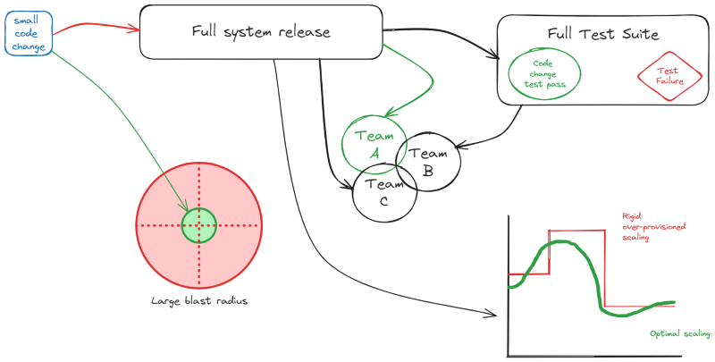

# Why Modernise
One of the main goals of modernising from legacy systems is to keep up with innovation. Software engineering continues to evolve at rapid pace. If your systems are legacy, they probably can't leverage modern tools and techniques, making it harder for you 
to keep pace with competitors.

## Challenges of monoliths

If your legacy systems are large and monolithic, they probably suffer from some or all of the following problems:
* Releasing a small change means a full system release
* You have to run the entire test suite, which may not pass for unrelated reasons which you'll then have to track down
* Changes and releases can effect multiple teams
* The software is fragile
* Scaling is rigid, so you often need to over provision to handle increased load
* There's a large blast radius for each change

**All the above makes it hard to adopt new technologies**

## Goals of modern applications
The high level goal of moving to modern applications is to be able to __deliver business value faster__ which helps 
you stay competitive in the market.

### Good Architecture
Modernising requires careful thought so that you end up with an architecture fit for purpose. If you design your new architecture well, you should get the following benefits
* Flexibility - good architecture buys you flexibility (i.e. the ability to change and evolve)
* Increased productivity because of things like concurrent dev and test of components
* Avoids vendor lock-in giving you increased leverage with suppliers (e.g. not having to use a particular RDBMS system)
* Provides agility to the business so it can quickly pivot and try new things
* Better for staff as they don't have to wrestle with legacy systems

### Strategies
Evolve to separate, decoupled, smaller functional services that focus on one thing, and does that really well. 

While you might be tempted to jump straight into microservices to achieve this, that's not your only option (or even the best option as microservices come with downsides too). For example you could utilise the [modular monolith](./Overview.md#modular-monolith) which might speed up the transition but still allow a move into microservices in the future.

The benefits of having decoupled services include:
* Teams become more autonomous, having ownership of architecture, development, deployment and maintenance of each service
* Which means they can make decisions quickly as these decisions only effect individual services (or modules / components ...)
* So they learn faster by making lots of small changes rather than one giant change